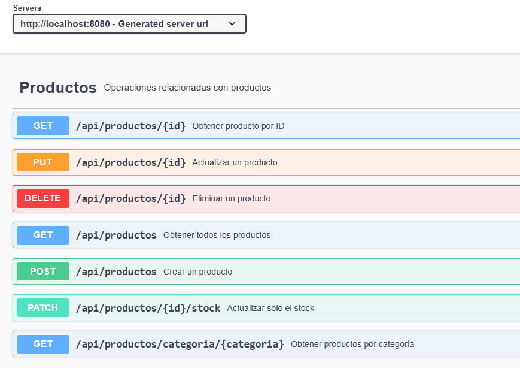
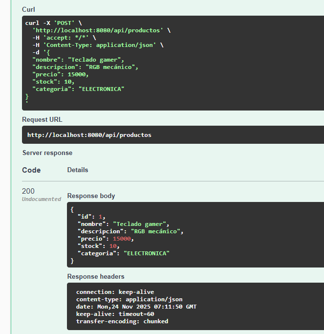
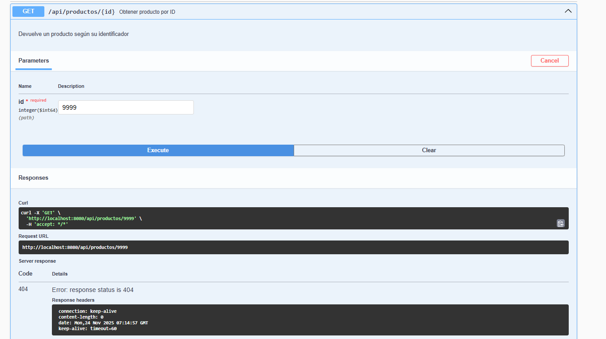
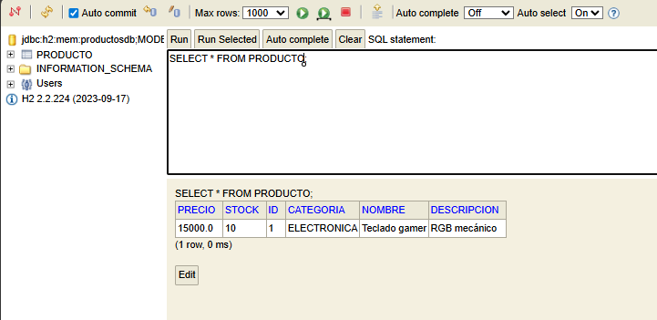

# API REST de Productos – Spring Boot

Trabajo práctico de UTN sobre desarrollo de APIs REST utilizando **Spring Boot**, **H2 Database**, **DTOs**, **Validaciones**, **Swagger/OpenAPI** y **Manejo Global de Excepciones**.

---

## Tecnologías utilizadas

- Java 17
- Spring Boot 3.5.8
- Spring Web
- Spring Data JPA
- H2 Database (en memoria)
- Lombok
- Springdoc OpenAPI / Swagger UI
- Maven

---

## Cómo ejecutar el proyecto

1. Clonar el repositorio:

   git clone https://github.com/SntLF02/Trabajo-Practico-APIs-REST-con-Spring-Boot.git

2. Abrir el proyecto en IntelliJ/Eclipse/VSCode.

3. Ejecutar la clase:

    ProductosApiApplication.java

4. La API se levanta en:

    http://localhost:8080

## Documentación Swagger

Disponible en:

 http://localhost:8080/swagger-ui/index.html

OpenAPI JSON:

 http://localhost:8080/v3/api-docs

## Endpoints principales
**Productos**
Método	       Endpoint	                        Descripción
GET	          /api/productos	                  Listar todos los productos
GET	          /api/productos/{id}	               Obtener un producto por ID
GET	          /api/productos/categoria/{cat}	   Filtrar por categoría
POST       	    /api/productos	                  Crear un producto
PUT	          /api/productos/{id}	               Actualizar un producto
PATCH	          /api/productos/{id}/stock	         Actualizar solo el stock
DELETE	       /api/productos/{id}	               Eliminar un producto

## Acceso a H2 Console

**URL**: http://localhost:8080/h2-console

**Datos de conexión**:

Campo	      Valor
Controlador   org.h2.Driver
JDBC URL	  jdbc:h2:mem:productosdb
Usuario	      sa
Password	  (vacío)

## Manejo de errores

La API utiliza un manejador global de excepciones (@ControllerAdvice).
Formato estándar:
{
  "timestamp": "2025-11-22 18:20:55",
  "status": 404,
  "message": "Producto no encontrado con id: 1",
  "path": "/api/productos/1"
}

## Documentación de Swagger

## Prueba POST

## Prueba GET

## Error 404 - Producto no existe

## Error 400 - Validación

## Consola H2

## Autor

**Santiago López** - Legajo: **52686**

## Conclusión
Este Proyecto me permitió entender cómo crear una API REST con Spring Boot aplicando buenas prácticas como el uso de DTOs,
validaciones, manejo de excepciones y documentación con Swagger. También practiqué la estructura por capas y
el uso de H2 para pruebas rápidas
